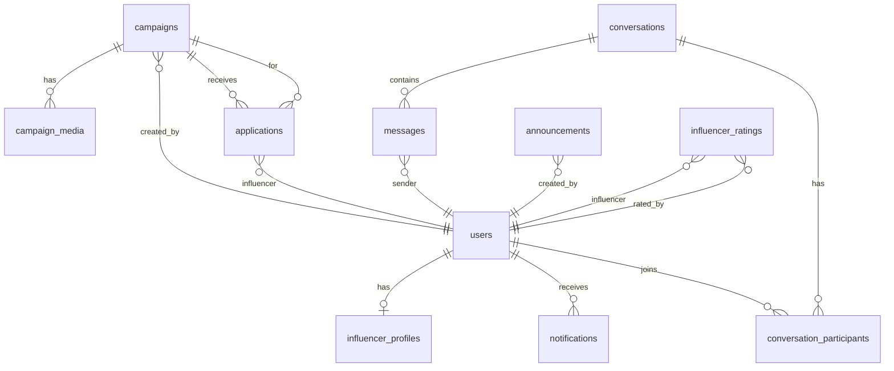

# Step 2: データベース設計 — PostgreSQL スキーマ

## ER図



---

## テーブル定義

### 1. `users` — ユーザー（管理者 + インフルエンサー共通）

```sql
CREATE TABLE users (
    id              SERIAL PRIMARY KEY,
    email           VARCHAR(255) UNIQUE NOT NULL,
    password_hash   VARCHAR(255) NOT NULL,
    role            VARCHAR(20) NOT NULL CHECK (role IN ('admin', 'influencer')),
    name            VARCHAR(100) NOT NULL,
    photo_url       TEXT,
    is_active       BOOLEAN DEFAULT true,
    created_at      TIMESTAMPTZ DEFAULT NOW(),
    updated_at      TIMESTAMPTZ DEFAULT NOW()
);
CREATE INDEX idx_users_role ON users(role);
CREATE INDEX idx_users_email ON users(email);
```

---

### 2. `influencer_profiles` — インフルエンサー追加情報

```sql
CREATE TABLE influencer_profiles (
    id                  SERIAL PRIMARY KEY,
    user_id             INTEGER UNIQUE NOT NULL REFERENCES users(id) ON DELETE CASCADE,
    handle              VARCHAR(100),           -- @hanako_lifestyle
    platform            VARCHAR(20),            -- instagram / youtube / tiktok
    followers           INTEGER DEFAULT 0,      -- 自己申告
    engagement_rate     DECIMAL(4,1),           -- 自己申告
    bio                 TEXT,
    genres              TEXT[],                  -- {"ホテル＆宿泊","飲食店"}
    price_range         VARCHAR(50),            -- "¥50,000〜"
    status              VARCHAR(20) DEFAULT '空き有り', -- 空き有り / 案件中
    admin_memo          TEXT,                   -- 管理者メモ
    created_at          TIMESTAMPTZ DEFAULT NOW(),
    updated_at          TIMESTAMPTZ DEFAULT NOW()
);
CREATE INDEX idx_inf_profiles_platform ON influencer_profiles(platform);
CREATE INDEX idx_inf_profiles_status ON influencer_profiles(status);
```

---

### 3. `campaigns` — 案件

```sql
CREATE TABLE campaigns (
    id              SERIAL PRIMARY KEY,
    created_by      INTEGER NOT NULL REFERENCES users(id),
    title           VARCHAR(255) NOT NULL,
    description     TEXT,
    status          VARCHAR(20) DEFAULT '募集中' CHECK (status IN ('募集中', '進行中', '完了')),
    category        VARCHAR(50),            -- ホテル＆宿泊 / 飲食店 / 体験＆ツアー
    area            VARCHAR(50),
    country         VARCHAR(50),
    platform        VARCHAR(20),            -- Instagram / YouTube / TikTok
    reward_style    VARCHAR(10) CHECK (reward_style IN ('gifting', 'paid')),
    min_budget      INTEGER DEFAULT 0,
    max_budget      INTEGER DEFAULT 0,
    publish_start   DATE,
    publish_end     DATE,
    start_date      DATE,
    end_date        DATE,
    headcount       VARCHAR(20),            -- "2〜3人"
    min_followers   VARCHAR(30),            -- "5万人以上"
    required_skills TEXT[],                 -- {"写真撮影","動画編集"}
    required_languages TEXT[],              -- {"日本語","英語"}
    video_url       TEXT,
    image_gradient  VARCHAR(100),           -- フロントエンド表示用グラデーション
    client_name     VARCHAR(255),           -- 施設名/クライアント名
    client_logo     VARCHAR(10),            -- ロゴ文字
    client_logo_color VARCHAR(100),         -- ロゴカラー
    created_at      TIMESTAMPTZ DEFAULT NOW(),
    updated_at      TIMESTAMPTZ DEFAULT NOW()
);
CREATE INDEX idx_campaigns_status ON campaigns(status);
CREATE INDEX idx_campaigns_category ON campaigns(category);
CREATE INDEX idx_campaigns_platform ON campaigns(platform);
CREATE INDEX idx_campaigns_created_at ON campaigns(created_at DESC);
```

---

### 4. `campaign_media` — 案件添付メディア

```sql
CREATE TABLE campaign_media (
    id              SERIAL PRIMARY KEY,
    campaign_id     INTEGER NOT NULL REFERENCES campaigns(id) ON DELETE CASCADE,
    file_url        TEXT NOT NULL,
    file_name       VARCHAR(255),
    file_type       VARCHAR(50),
    file_size       INTEGER,
    created_at      TIMESTAMPTZ DEFAULT NOW()
);
CREATE INDEX idx_campaign_media_campaign ON campaign_media(campaign_id);
```

---

### 5. `applications` — 案件応募

```sql
CREATE TABLE applications (
    id              SERIAL PRIMARY KEY,
    campaign_id     INTEGER NOT NULL REFERENCES campaigns(id) ON DELETE CASCADE,
    influencer_id   INTEGER NOT NULL REFERENCES users(id),
    comment         TEXT,
    verdict         VARCHAR(10) DEFAULT 'pending' CHECK (verdict IN ('pending', 'pass', 'fail')),
    applied_at      TIMESTAMPTZ DEFAULT NOW(),
    updated_at      TIMESTAMPTZ DEFAULT NOW(),
    UNIQUE(campaign_id, influencer_id)
);
CREATE INDEX idx_applications_campaign ON applications(campaign_id);
CREATE INDEX idx_applications_influencer ON applications(influencer_id);
CREATE INDEX idx_applications_verdict ON applications(verdict);
```

---

### 6. `conversations` — 会話

```sql
CREATE TABLE conversations (
    id              SERIAL PRIMARY KEY,
    campaign_id     INTEGER REFERENCES campaigns(id),  -- 紐付く案件（任意）
    created_at      TIMESTAMPTZ DEFAULT NOW(),
    updated_at      TIMESTAMPTZ DEFAULT NOW()
);
```

### 7. `conversation_participants` — 会話参加者

```sql
CREATE TABLE conversation_participants (
    id              SERIAL PRIMARY KEY,
    conversation_id INTEGER NOT NULL REFERENCES conversations(id) ON DELETE CASCADE,
    user_id         INTEGER NOT NULL REFERENCES users(id),
    unread_count    INTEGER DEFAULT 0,
    UNIQUE(conversation_id, user_id)
);
CREATE INDEX idx_conv_part_user ON conversation_participants(user_id);
```

### 8. `messages` — メッセージ

```sql
CREATE TABLE messages (
    id              SERIAL PRIMARY KEY,
    conversation_id INTEGER NOT NULL REFERENCES conversations(id) ON DELETE CASCADE,
    sender_id       INTEGER NOT NULL REFERENCES users(id),
    text            TEXT NOT NULL,
    is_read         BOOLEAN DEFAULT false,
    created_at      TIMESTAMPTZ DEFAULT NOW()
);
CREATE INDEX idx_messages_conversation ON messages(conversation_id, created_at);
```

---

### 9. `announcements` — お知らせ

```sql
CREATE TABLE announcements (
    id              SERIAL PRIMARY KEY,
    created_by      INTEGER NOT NULL REFERENCES users(id),
    title           VARCHAR(255) NOT NULL,
    body            TEXT NOT NULL,
    category        VARCHAR(20) DEFAULT 'お知らせ',  -- お知らせ/重要/緊急/システム
    target          VARCHAR(20) DEFAULT 'all',        -- all / active
    publish_at      TIMESTAMPTZ,
    expire_at       TIMESTAMPTZ,
    created_at      TIMESTAMPTZ DEFAULT NOW(),
    updated_at      TIMESTAMPTZ DEFAULT NOW()
);
CREATE INDEX idx_announcements_created ON announcements(created_at DESC);
```

---

### 10. `notifications` — 通知

```sql
CREATE TABLE notifications (
    id              SERIAL PRIMARY KEY,
    user_id         INTEGER NOT NULL REFERENCES users(id) ON DELETE CASCADE,
    title           TEXT NOT NULL,
    body            TEXT,
    type            VARCHAR(30),    -- application / message / campaign / system
    reference_id    INTEGER,        -- 参照先ID（案件ID、応募IDなど）
    is_read         BOOLEAN DEFAULT false,
    created_at      TIMESTAMPTZ DEFAULT NOW()
);
CREATE INDEX idx_notifications_user ON notifications(user_id, is_read, created_at DESC);
```

---

### 11. `influencer_ratings` — インフルエンサー評価

```sql
CREATE TABLE influencer_ratings (
    id              SERIAL PRIMARY KEY,
    influencer_id   INTEGER NOT NULL REFERENCES users(id),
    rated_by        INTEGER NOT NULL REFERENCES users(id),
    rating          INTEGER NOT NULL CHECK (rating BETWEEN 1 AND 5),
    created_at      TIMESTAMPTZ DEFAULT NOW(),
    updated_at      TIMESTAMPTZ DEFAULT NOW(),
    UNIQUE(influencer_id, rated_by)
);
CREATE INDEX idx_ratings_influencer ON influencer_ratings(influencer_id);
```

---

## テーブル数サマリー

| # | テーブル名 | 行数予測 | 備考 |
|---|-----------|---------|------|
| 1 | `users` | 〜300 | 管理者+インフルエンサー |
| 2 | `influencer_profiles` | 〜250 | 1:1 with users |
| 3 | `campaigns` | 〜100 | 案件マスター |
| 4 | `campaign_media` | 〜300 | 案件添付ファイル |
| 5 | `applications` | 〜500 | 案件×インフルエンサー |
| 6 | `conversations` | 〜200 | 会話ヘッダー |
| 7 | `conversation_participants` | 〜400 | 会話参加者 |
| 8 | `messages` | 〜5000 | チャットメッセージ |
| 9 | `announcements` | 〜50 | お知らせ |
| 10 | `notifications` | 〜2000 | 通知 |
| 11 | `influencer_ratings` | 〜250 | 評価 |

---

## マスターデータ

カテゴリー、エリア、国、プラットフォーム、スキル、言語はフロントエンドで定義済みのENUM的な値です。  
初期段階では**バックエンドのコード内定数**として管理し、将来的に必要であればマスターテーブル化します。

```python
CATEGORIES = ["ホテル＆宿泊", "飲食店", "体験＆ツアー"]
AREAS = ["全国", "関東", "関西", "東海", "九州・沖縄", "北海道・東北", "中国・四国", "海外"]
COUNTRIES = ["日本", "アメリカ", "韓国", "中国", "台湾", "東南アジア", "ヨーロッパ"]
PLATFORMS = ["Instagram", "YouTube", "TikTok"]
SKILLS = ["写真撮影", "動画編集", "ライティング", "グラフィックデザイン", "ライブ配信"]
LANGUAGES = ["日本語", "英語", "韓国語", "中国語（簡体字）", "中国語（繁体字）", "スペイン語", "フランス語", "その他"]
```
